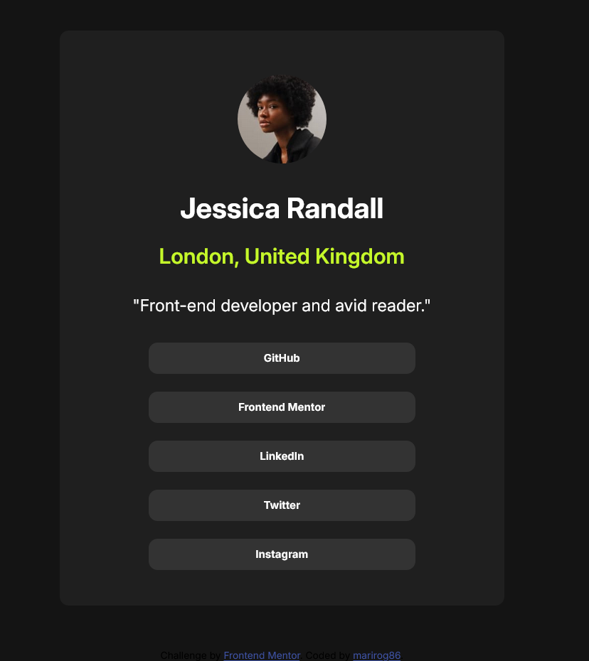

# Frontend Mentor - Social links profile solution

This is a solution to the [Social links profile challenge on Frontend Mentor](https://www.frontendmentor.io/challenges/social-links-profile-UG32l9m6dQ).  

## Table of contents

  - [Screenshot](#screenshot)
  - [Built with](#built-with)
- [Author](#author)

### Screenshot

### Built with

- Semantic HTML5 markup
- CSS custom properties
- Flexbox

## Author

- Website - [Marina Rogova](https://github.com/marirog86)
- Frontend Mentor - [@marirog86](https://www.frontendmentor.io/profile/marirog86)

